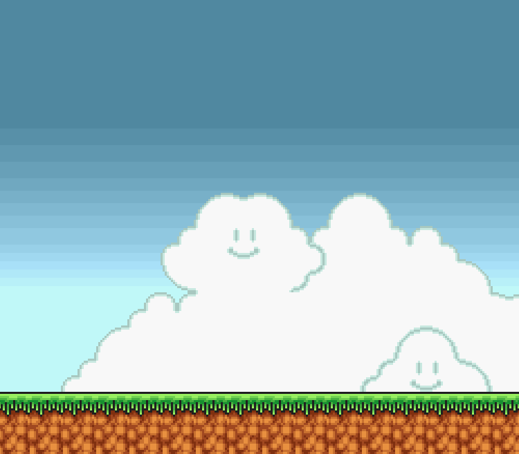

# Mario-SDL2
Game progress:

# Compiling
I use Visual Studio 2019 to compile this project. The following libraries are used:
- SDL version 2.0.18
- SDL_image 2.0.5
- SDL_ttf 2.0.15 (currently unused but still included)
# Details
Sprites used in this project can be found below:
https://www.spriters-resource.com/custom_edited/mariocustoms/sheet/63930/
https://mfgg.net/index.php?act=resdb&param=02&c=1&id=35344